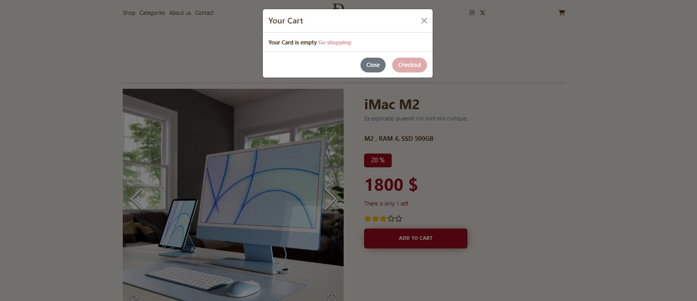
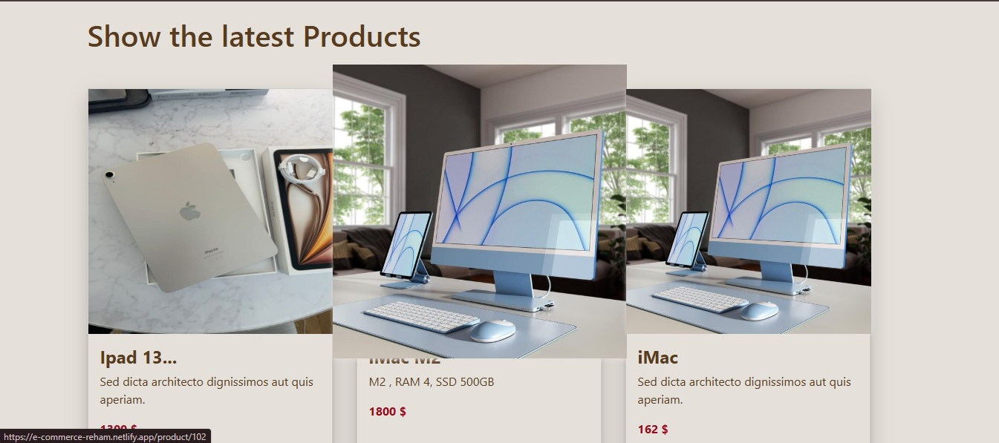
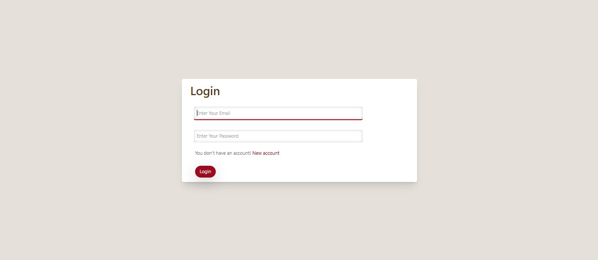
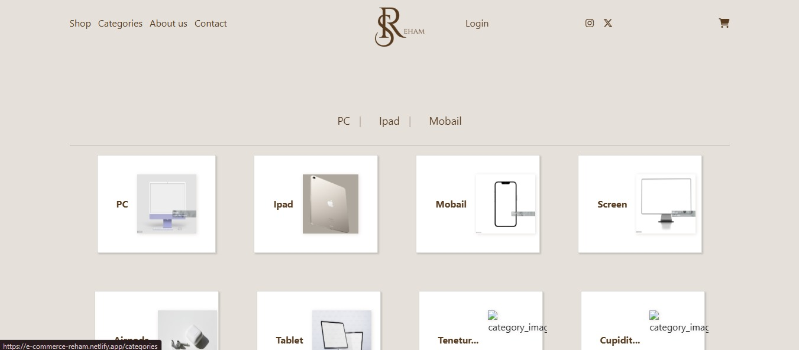

# E-Commerce Frontend Template

This is a responsive front-end template for an e-commerce platform created as a practice project.  
The design simulates a real online store experience with categories, product listing, and interactive UI elements.

## ✨ Features

- Homepage with featured products and promotional banners
- Navigation bar with categories: PC, Ipad, Mobile
- Product cards with:
  - Image
  - Price and sale badge
  - Color selection options
  - Add to Cart button
- About us and Contact pages
- Responsive layout for different screen sizes

## 🛠️ Technologies Used

- HTML5  
- CSS3 (Flexbox, Grid, Media Queries)  
- JavaScript / React (for interactivity)  
- Font Awesome & Google Fonts

## 🖼️ Preview








## 🌐 Live Demo

👉 [Visit the website](https://e-commerce-reham.netlify.app)

## 📁 How to Use

1. Clone this repository:
   ```bash
   git clone https://github.com/Reham-abo-shaheen/E-commerce-frontend.git
